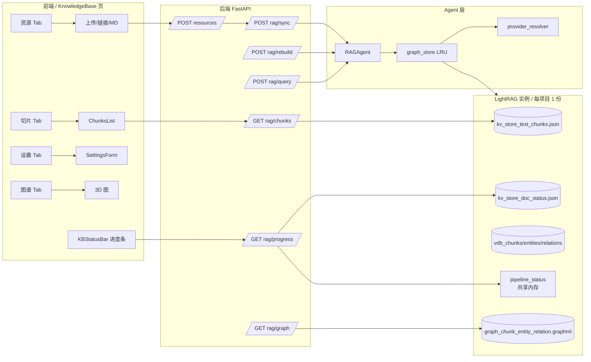
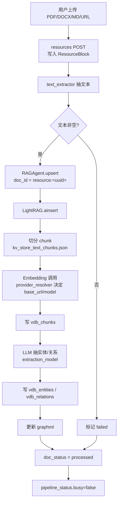
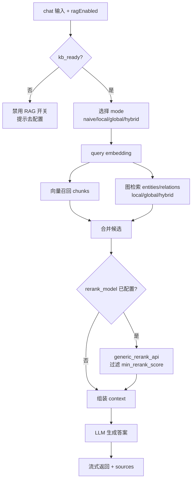
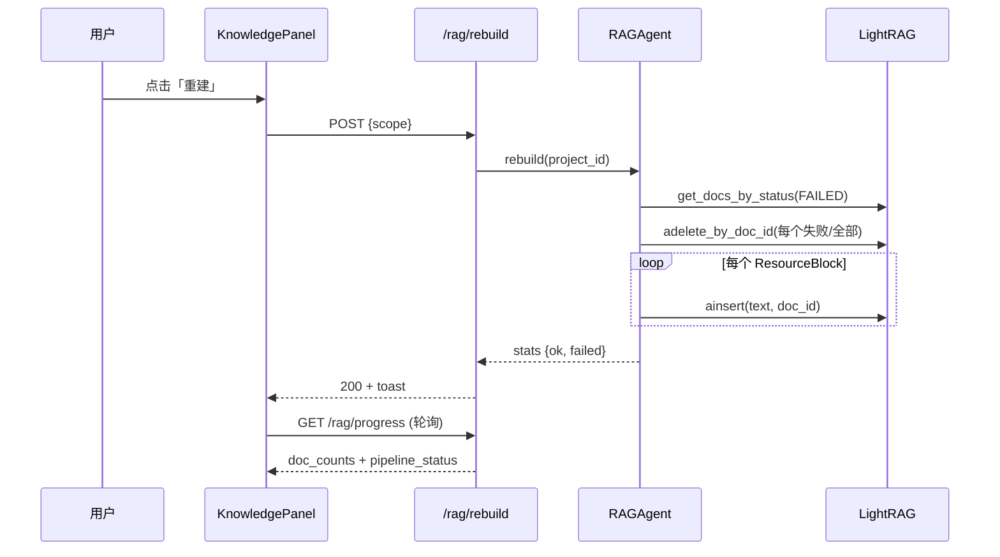

# 文件管理与知识库模块

## 模块目标

负责项目级资源（文件 / Markdown / 链接）的上传、文本抽取，以及基于 [LightRAG](https://github.com/HKUDS/LightRAG) 的图增强检索：包含切片入库、向量召回、图检索、可选 rerank、查询统一入口与索引状态可观测性。

## 关键代码入口

| 层 | 路径 | 职责 |
| --- | --- | --- |
| API | [backend/app/api/resources.py](../../../backend/app/api/resources.py) | 资源 CRUD + 文本提取 |
| API | [backend/app/api/rag.py](../../../backend/app/api/rag.py) | 状态、同步、重建、查询、图、**chunks**、**progress** |
| API | [backend/app/api/project_settings.py](../../../backend/app/api/project_settings.py) | 项目级 KB 设置（providers / models / **rerank**） |
| Agent | [backend/agents/rag/agent.py](../../../backend/agents/rag/agent.py) | `RAGAgent`：upsert / delete / rebuild / query 包装 |
| Storage | [backend/agents/rag/graph_store.py](../../../backend/agents/rag/graph_store.py) | LRU 缓存的 `LightRAG` 实例工厂 |
| Storage | [backend/agents/rag/provider_resolver.py](../../../backend/agents/rag/provider_resolver.py) | 解析 LLM / Embedding / Rerank 提供方 |
| Frontend | [frontend/src/pages/KnowledgeBase.tsx](../../../frontend/src/pages/KnowledgeBase.tsx) | 知识库主页（5 tab） |
| Frontend | [frontend/src/components/knowledge/KBStatusBar.tsx](../../../frontend/src/components/knowledge/KBStatusBar.tsx) | 进度条 + `useKBProgress` hook |
| Frontend | [frontend/src/components/knowledge/ChunksList.tsx](../../../frontend/src/components/knowledge/ChunksList.tsx) | 切片浏览 |
| Frontend | [frontend/src/components/knowledge/SettingsForm.tsx](../../../frontend/src/components/knowledge/SettingsForm.tsx) | 模型/Rerank 配置表单 |

## 1. 总体架构

## 2. 入库流程（Ingestion）

资源被创建或重建时，文本经文本抽取 → LightRAG `ainsert` → 切片 → embedding → 实体/关系抽取 → 写入向量库与图。

## 3. 查询流程（Query）

## 4. 重建流程（Rebuild）

## 5. LightRAG 内部存储约定

| 文件 | 内容 |
| --- | --- |
| `kv_store_text_chunks.json` | `chunk-<md5> → {tokens, content, chunk_order_index, full_doc_id, file_path}` |
| `kv_store_doc_status.json` | `resource:<uuid> → {status, chunks_count, chunks_list, content_summary, error}` |
| `vdb_chunks/entities/relations.json` | nano-vectordb 持久化向量 |
| `graph_chunk_entity_relation.graphml` | NetworkX 图 |
| 共享内存 | `get_namespace_data("pipeline_status", workspace=rag.workspace)` |

## 6. 新增 API 概览

| 方法 | 路径 | 用途 |
| --- | --- | --- |
| GET | `/projects/{id}/rag/chunks?limit&offset&search&doc_id` | 分页浏览所有切片 + 关联 ResourceBlock 标题 |
| GET | `/projects/{id}/rag/progress` | `kb_ready / busy / job_name / latest_message / cur_batch / total_batches / doc_counts / failed_docs` |
| GET/PUT | `/projects/{id}/knowledge/settings` | 新增字段 `rerank_model`、`min_rerank_score`（0–1） |

## 7. Rerank 配置

- 字段：`rerank_model`（如 `gte-rerank` / `gte-rerank-v2`）+ `min_rerank_score`（默认空 = 0）。
- 解析：`provider_resolver._RERANK_DEFAULTS` 给已知模型回填 DashScope 端点；未知模型回退主 `api_base`。
- 调用：`graph_store._make_instance` 用 `functools.partial(generic_rerank_api, ...)` 注入 `rerank_model_func`，并设 `min_rerank_score`。
- 触发：仅当 `rerank_model` 非空时，`RAGAgent.query` 才会在 `QueryParam` 加 `enable_rerank=True`。
- 端点格式：`*.dashscope.aliyuncs.com` 走 `aliyun` 信封，其余走 `standard`。

## 8. 状态可观测性 & 功能开关

`useKBProgress(projectId)` 是前端单一来源：

- `KBStatusBar`：每个 KB tab 顶部常驻；轮询 1.5s（busy）/ 10s（idle）。
- `ChatPanel`：`!kb_ready` 时 RAG 复选框禁用 + 提示「去配置」；`busy` 时显示「索引中…」。
- `AICardEditor`：生成时根据 `kb_ready` 决定是否带 `ragEnabled=true`。
- `KnowledgePanel`：`busy` 时禁用「重建 / 重置」按钮，避免并发 pipeline。

## 9. 边界情况

| 场景 | 行为 |
| --- | --- |
| 第一次上传，无任何已处理文档 | `kb_ready=false`，所有 RAG UI 禁用 |
| 索引进行中（`busy=true`） | 重建/重置禁用、Chat 内 RAG 禁用 |
| 部分资源失败 | `progress.failed_docs` 列出，可在 KBStatusBar 展开查看 |
| Rerank 模型名未识别 | 用主 `api_base/api_key`，调用失败时仅 warning，不阻断查询 |
| `project_settings` 表缺列 | `init_db` 内 `_apply_adhoc_migrations` 自动 `ALTER TABLE ADD COLUMN` |

## 10. 后续可补充文档

- `workflow.md`：详细时序与错误恢复
- `api.md`：完整字段定义
- `edge-cases.md`：删除残留、跨项目隔离、超大文档分批
